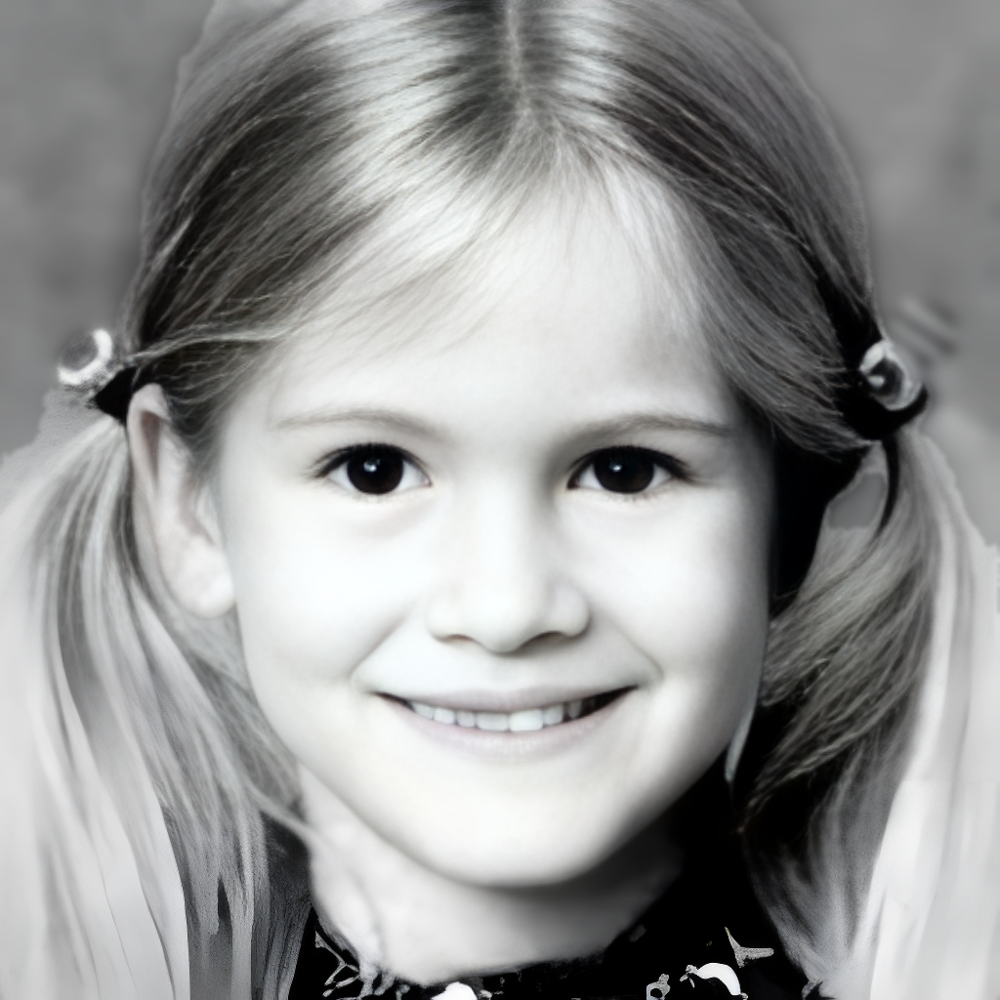
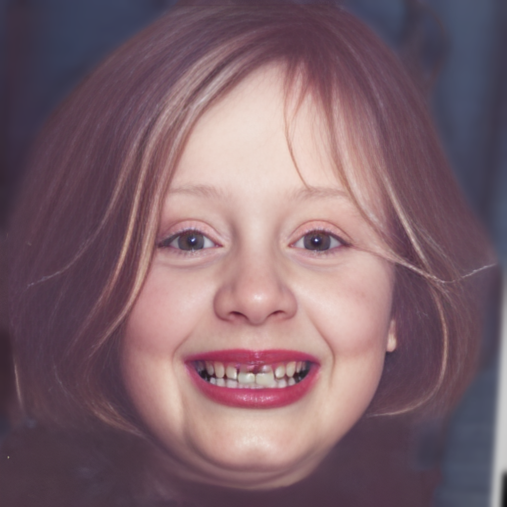
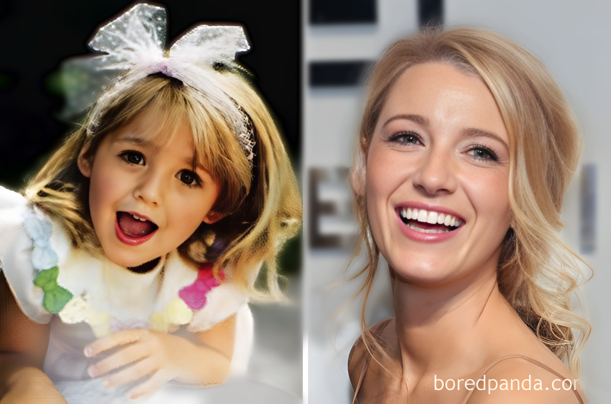

# 🚀 NovaFix AI: The Ultimate Neural Portrait Studio

<br>

<div align="center">


</div>

<br>

### ✨ Transforming Yesterday's Memories into Tomorrow's Masterpieces

NovaFix AI isn't just an image restorer; it's a sophisticated production pipeline designed to bridge the gap between low-quality snapshots and professional studio photography. By weaving together advanced **Generative Facial Priors (GFPGAN)** and high-fidelity upscaling (**Real-ESRGAN**), we’ve built a tool that breathes life back into blurry, aged, or low-resolution portraits while preserving the authentic soul of the subject.

---

## 🖼️ Visual Results (NovaFix Studio Render)

Experience the "NovaFix" effect. We don't just clear up pixels; we reconstruct facial geometry and apply cinematic depth-of-field for a high-end studio finish.

| 📷 Original Input | ✨ NovaFix AI Enhanced |
| :---: | :---: |
|  |  |
|  |  |
|  |  |

> **Studio Insight:** Every render utilizes our custom **Neural Bokeh Master**, isolating the subject and applying a soft, professional blur to the background for maximum impact.

---

## 🔥 Key Features

* 💎 **Authentic Restoration**: Powered by the **GFPGAN v1.3** engine for natural skin textures.
* 🌆 **Full-Frame Clarity**: Uses **Real-ESRGAN** to ensure the background is as sharp as the face.
* 🎭 **Cinematic Depth**: Integrated **MediaPipe Selfie Segmentation** for professional bokeh effects.
* 💻 **Windows Optimized**: A "clean" build that works on standard setups without complex CUDA errors.

---

## :wrench: Dependencies and Installation

1. **Clone the repository**
    ```bash
    git clone [https://github.com/Puneetas015/NovaFix_AI.git](https://github.com/Puneetas015/NovaFix_AI.git)
    cd NovaFix_AI
    ```

1. **Install dependent packages**
    ```bash
    pip install -r requirements.txt
    ```

---

## :zap: Quick Inference

**1. Download Pre-trained Models**
Place these in the root directory:
* [GFPGANv1.3.pth](https://github.com/TencentARC/GFPGAN/releases/download/v1.3.0/GFPGANv1.3.pth)
* [selfie_segmenter.tflite](https://developers.google.com/mediapipe/solutions/vision/selfie_segmenter#models)

**2. Process Images**
Place images in `inputs/` and run:
```bash
python main.py
